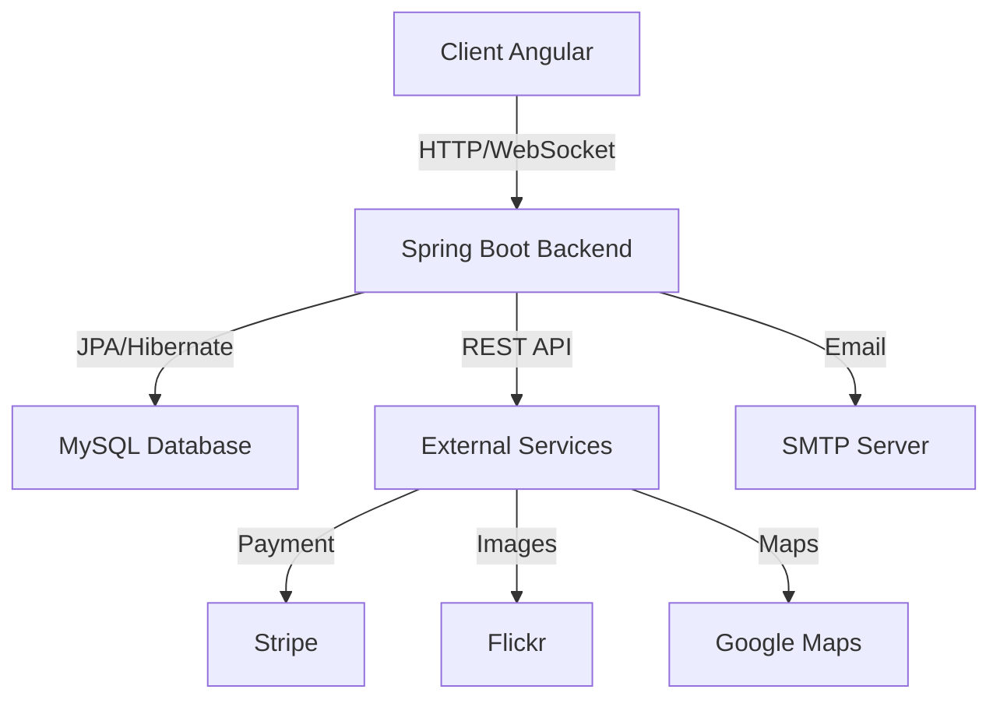

<div align="center">

# 🚗🏠 CO-CO Platform

### *Carpooling & Roommate Sharing Management System*

[](https://spring.io/projects/spring-boot)
[](https://angular.io/)
[](https://www.oracle.com/java/)
[](https://www.mysql.com/)
[](LICENSE)

*A comprehensive platform for carpooling and roommate sharing management, facilitating mobility and housing sharing between students and professionals.*

[🚀 Demo](#demo) • [📖 Documentation](#documentation) • [🛠️ Installation](#installation) • [🤝 Contributing](#contributing)

</div>

---

## 📋 Table of Contents

- [✨ Features](#-features)
- [🏗️ Architecture](#️-architecture)
- [🛠️ Technologies](#️-technologies)
- [⚙️ Installation](#️-installation)
- [🚀 Getting Started](#-getting-started)
- [📁 Project Structure](#-project-structure)
- [🔐 Security](#-security)
- [🌐 API Documentation](#-api-documentation)
- [🤝 Contributing](#-contributing)
- [📄 License](#-license)

---

## ✨ Features

### 🚗 Carpooling Module

<table>
<tr>
<td width="50%">

#### 📢 Announcements
- ✅ Create carpooling announcements
- 🔍 Advanced search by destination/date
- 📍 Google Maps integration
- 🗺️ Optimized route calculation

</td>
<td width="50%">

#### 🤝 Interactions
- 💬 Booking requests
- ⭐ Rating system (5 stars)
- 👍 Announcement reactions
- 📊 Trip statistics

</td>
</tr>
</table>

### 🏠 Roommate Sharing Module

<table>
<tr>
<td width="50%">

#### 🏡 Housing Management
- 🏘️ Roommate sharing announcements
- 🏠 House/apartment management
- 📸 Image upload (Flickr)
- 💰 Flexible pricing

</td>
<td width="50%">

#### 📝 Features
- 📋 Rental contracts
- 💬 Comments and reviews
- ⭐ Rating system
- 📊 Statistical charts

</td>
</tr>
</table>

### 🛒 E-Commerce Module

- 🛍️ Product catalog
- 🗂️ Category management
- 🛒 Shopping cart
- 💳 Stripe payment integration
- 📦 Order tracking
- 🚚 Delivery management

### 💬 Social & Communication Module

- 📱 Community forum
- 💬 Real-time chat (WebSocket)
- 📝 Posts and comments
- 👍 Reaction system
- 🤖 Intelligent chatbot
- 📧 Email notifications

### 👤 User Management

- 🔐 JWT authentication
- 👥 User profiles
- 🎭 Role management (Admin, User)
- ✉️ Email verification
- 🔒 Enhanced security

### 📊 Additional Features

- 📈 Analytics dashboards
- 📊 Interactive charts (Pie Charts)
- 🎯 Quizzes and tests
- 🏥 Vehicle health tracking
- 📋 Claims system
- 🧪 Unit and integration tests

---

## 🏗️ Architecture



### Layered Architecture

```
┌─────────────────────────────────────┐
│     Presentation Layer (Angular)    │
├─────────────────────────────────────┤
│     Controller Layer (REST API)     │
├─────────────────────────────────────┤
│     Service Layer (Business Logic)  │
├─────────────────────────────────────┤
│     Repository Layer (Data Access)  │
├─────────────────────────────────────┤
│     Database Layer (MySQL)          │
└─────────────────────────────────────┘
```

---

## 🛠️ Technologies

### Backend

<div align="center">

| Technology | Version | Description |
|------------|---------|-------------|
|  | 17 | Main language |
|  | 3.1.8 | Backend framework |
|  | 6.x | Security & JWT |
|  | 8.0 | Database |
|  | 3.x | Dependency management |
|  | - | Real-time chat |

</div>

### Frontend

<div align="center">

| Technology | Version | Description |
|------------|---------|-------------|
|  | 15+ | Frontend framework |
|  | 5.x | Typed language |
|  | 5.x | CSS framework |
|  | 7.x | Reactive programming |

</div>

### External Services

- 💳 **Stripe** - Online payments
- 📸 **Flickr** - Image storage
- 🗺️ **Google Maps API** - Mapping
- 📧 **SMTP** - Email sending

---

## ⚙️ Installation

### Prerequisites

```bash
☑️ Java 17 or higher
☑️ Node.js 16+ and npm
☑️ MySQL 8.0+
☑️ Maven 3.6+
☑️ Git
```

### 1️⃣ Clone the Repository

```bash
git clone https://github.com/hamayari/CO-CO.git
cd CO-CO
```

### 2️⃣ Backend Configuration

#### MySQL Database

```sql
CREATE DATABASE Backend;
USE Backend;
```

#### Configure application.properties

```properties
# Backend/src/main/resources/application.properties
server.port=9092

# Database
spring.datasource.url=jdbc:mysql://localhost:3306/Backend
spring.datasource.username=root
spring.datasource.password=

# JPA
spring.jpa.hibernate.ddl-auto=update
spring.jpa.show-sql=true

# JWT
jwt.secret=YourSecretKeyHere
jwt.expiration=86400000

# Stripe
stripe.api.key=your_stripe_key

# Flickr
flickr.api.key=your_flickr_key
flickr.api.secret=your_flickr_secret
```

#### Start the Backend

```bash
cd Backend
mvn clean install
mvn spring-boot:run
```

The backend will be accessible at `http://localhost:9092`

### 3️⃣ Frontend Configuration

```bash
cd Frontend/COCO-ESPRIT-main/COCO-ESPRIT
npm install
```

#### Configure environment.ts

```typescript
export const environment = {
  production: false,
  apiUrl: 'http://localhost:9092/api',
  stripeKey: 'your_stripe_public_key'
};
```

#### Start the Frontend

```bash
npm start
```

The frontend will be accessible at `http://localhost:4200`

---

## 🚀 Getting Started

### Quick Start

```bash
# Terminal 1 - Backend
cd Backend
mvn spring-boot:run

# Terminal 2 - Frontend
cd Frontend/COCO-ESPRIT-main/COCO-ESPRIT
npm start
```

### Application Access

- 🌐 **Frontend**: http://localhost:4200
- 🔧 **Backend API**: http://localhost:9092
- 📚 **Swagger UI**: http://localhost:9092/swagger-ui.html
- 📖 **API Docs**: http://localhost:9092/v3/api-docs

### Test Accounts

```
Admin:
📧 Email: admin@coco.com
🔑 Password: admin123

User:
📧 Email: user@coco.com
🔑 Password: user123
```

---

## 📁 Project Structure

```
CO-CO/
├── 📂 Backend/
│   ├── 📂 src/
│   │   ├── 📂 main/
│   │   │   ├── 📂 java/tn/esprit/backendpi/
│   │   │   │   ├── 📂 Config/          # Spring Configuration
│   │   │   │   ├── 📂 Controller/      # REST Controllers
│   │   │   │   ├── 📂 Service/         # Business Logic
│   │   │   │   ├── 📂 Repository/      # Data Access
│   │   │   │   ├── 📂 Entities/        # JPA Entities
│   │   │   │   ├── 📂 Dto/             # Data Transfer Objects
│   │   │   │   └── 📂 Security/        # JWT & Security
│   │   │   └── 📂 resources/
│   │   │       └── application.properties
│   │   └── 📂 test/                    # Unit tests
│   ├── pom.xml
│   └── README.md
│
├── 📂 Frontend/
│   └── 📂 COCO-ESPRIT-main/COCO-ESPRIT/
│       ├── 📂 src/
│       │   ├── 📂 app/
│       │   │   ├── 📂 BackOffice/      # Admin Dashboard
│       │   │   ├── 📂 FrontOffice/     # User Interface
│       │   │   ├── 📂 Services/        # API Services
│       │   │   ├── 📂 Models/          # TypeScript Models
│       │   │   └── 📂 Guards/          # Route Guards
│       │   ├── 📂 assets/              # Images, CSS, JS
│       │   └── 📂 environments/        # Environment configs
│       ├── package.json
│       └── angular.json
│
└── README.md                           # This file
```

---

## 🔐 Security

### JWT Authentication

```java
// Authentication flow
User Login → JWT Token Generated → Token Stored → 
API Requests with Token → Token Validation → Access Granted
```

### Protected Endpoints

| Endpoint | Required Role | Description |
|----------|---------------|-------------|
| `/api/admin/**` | ADMIN | Administration |
| `/api/user/**` | USER, ADMIN | Users |
| `/api/auth/**` | PUBLIC | Authentication |

### Implemented Security

- ✅ JWT Token Authentication
- ✅ Password Encryption (BCrypt)
- ✅ CORS Configuration
- ✅ SQL Injection Protection
- ✅ XSS Protection
- ✅ CSRF Protection

---

## 🌐 API Documentation

### Main Endpoints

#### 🔐 Authentication
```http
POST   /api/auth/signup          # Sign up
POST   /api/auth/signin          # Sign in
POST   /api/auth/refresh         # Refresh token
```

#### 🚗 Carpooling
```http
GET    /api/carpooling/announcements        # List announcements
POST   /api/carpooling/announcements        # Create announcement
GET    /api/carpooling/announcements/{id}   # Announcement details
PUT    /api/carpooling/announcements/{id}   # Update announcement
DELETE /api/carpooling/announcements/{id}   # Delete announcement
POST   /api/carpooling/requests              # Booking request
POST   /api/carpooling/ratings               # Rate trip
```

#### 🏠 Roommate Sharing
```http
GET    /api/collocation/announcements        # List announcements
POST   /api/collocation/announcements        # Create announcement
GET    /api/collocation/houses               # List houses
POST   /api/collocation/houses               # Add house
POST   /api/collocation/contracts            # Create contract
```

#### 🛒 E-Commerce
```http
GET    /api/products                # List products
POST   /api/products                # Add product
GET    /api/categories              # List categories
POST   /api/orders                  # Create order
POST   /api/payment/stripe          # Stripe payment
```

#### 💬 Social
```http
GET    /api/posts                   # List posts
POST   /api/posts                   # Create post
POST   /api/comments                # Comment
POST   /api/reactions               # React
GET    /api/chat/messages           # Chat messages
```

### Interactive Documentation

Access Swagger UI to test APIs: `http://localhost:9092/swagger-ui.html`

---

## 🤝 Contributing

### Git Workflow

```bash
# 1. Create a feature branch
git checkout -b feature/my-new-feature

# 2. Make your changes
git add .
git commit -m "✨ Add my new feature"

# 3. Push to GitHub
git push origin feature/my-new-feature

# 4. Create a Pull Request to develop
```

### Branches

- `main` - Stable production
- `develop` - Active development
- `feature/*` - New features
- `bugfix/*` - Bug fixes
- `hotfix/*` - Urgent fixes

### Code Standards

- ✅ Follow Java/TypeScript conventions
- ✅ Comment complex code
- ✅ Write unit tests
- ✅ Respect SOLID principles
- ✅ Use conventional commits

---

## 📊 Project Statistics

```
📦 Backend Modules:     30+
🎨 Angular Components:  100+
📝 Lines of Code:       50,000+
🧪 Tests:               200+
📚 API Endpoints:       150+
```

---

## 🐛 Troubleshooting

### Issue: Port already in use

```bash
# Windows
netstat -ano | findstr :9092
taskkill /PID <PID> /F

# Linux/Mac
lsof -ti:9092 | xargs kill -9
```

### Issue: Database connection

```bash
# Check MySQL
mysql -u root -p
SHOW DATABASES;
USE Backend;
SHOW TABLES;
```

---

## 📄 License

This project is licensed under the MIT License. See the [LICENSE](LICENSE) file for details.

---

## 👥 Team

<div align="center">

Developed with ❤️ by the CO-CO Team

[](https://github.com/hamayari)

</div>

---

## 📞 Contact & Support

- 📧 Email: support@coco-platform.com
- 🐛 Issues: [GitHub Issues](https://github.com/hamayari/CO-CO/issues)
- 💬 Discussions: [GitHub Discussions](https://github.com/hamayari/CO-CO/discussions)

---

<div align="center">

### ⭐ If you like this project, don't hesitate to give it a star!

**Made with ❤️ using Spring Boot & Angular**

</div>
